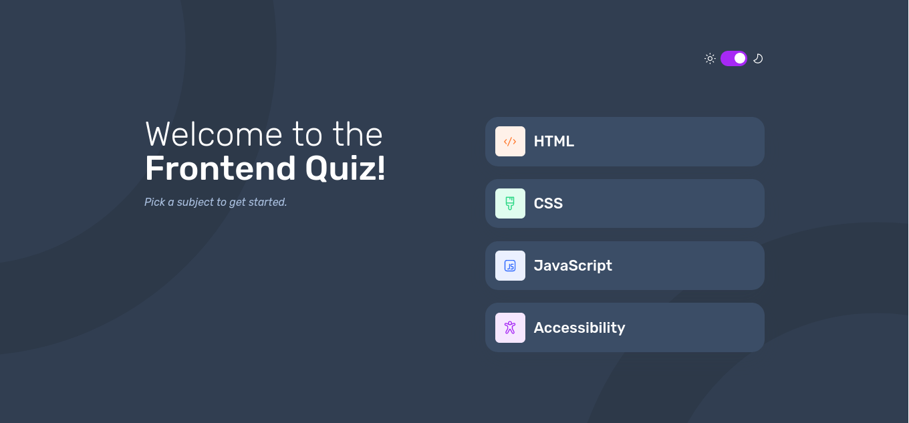

# Frontend Mentor - Frontend quiz app solution

This is a solution to the [Frontend quiz app challenge on Frontend Mentor](https://www.frontendmentor.io/challenges/frontend-quiz-app-BE7xkzXQnU). Frontend Mentor challenges help you improve your coding skills by building realistic projects. 

## Table of contents

- [Overview](#overview)
  - [The challenge](#the-challenge)
  - [Screenshot](#screenshot)
  - [Links](#links)
- [My process](#my-process)
  - [Built with](#built-with)
  - [What I learned](#what-i-learned)
  - [Continued development](#continued-development)
  - [Useful resources](#useful-resources)
- [Author](#author)
- [Acknowledgments](#acknowledgments)

## Overview
This frontend quiz app is designed to provide an engaging and interactive experience for users to test their knowledge on various topics in frontend development. It features a user-friendly interface that allows easy navigation through quiz questions and options. 

### The challenge

Users should be able to:

- Select a quiz subject
- Select a single answer from each question from a choice of four
- See an error message when trying to submit an answer without making a selection
- See if they have made a correct or incorrect choice when they submit an answer
- Move on to the next question after seeing the question result
- See a completed state with the score after the final question
- Play again to choose another subject
- View the optimal layout for the interface depending on their device's screen size
- See hover and focus states for all interactive elements on the page
- Navigate the entire app only using their keyboard
- **Bonus**: Change the app's theme between light and dark

### Screenshot

### Links

- Solution URL: https://github.com/derry369/frontend-quiz-app
- Live Site URL: https://frontend-quiz-app-omega.vercel.app/

## My process

1. Define the App Functionality: Started by outlining the core functionalities from the user's perspective.
2. Plan the Tech Stack:
        ◦ Frontend framework: React
        ◦ Type checking: TypeScript
        ◦ CSS-in-JS library: styled-components
        ◦ Version control system: Git with a workflow like Git flow
3. Component Breakdown: Defined the components required to build the user interface (UI) and handle user interactions. 
4. Develop the UI:
    • Used React and styled-components to develop the UI components.
    • Used CSS media queries to adapt the layout of the app to different screen sizes. This will ensure that the app is usable on devices like mobiles, tablets, and desktops.
5. Implement Functionality:
    • Used React's state management features (useState) to manage quiz data (questions, answers, user choices, score etc.)
    • Implemented logic to handle user interactions like question selection, answer submission, and navigation between sections.
    • Integrate error handling to display messages when a user tries to submit without selecting an answer.
    • Provide feedback to the user indicating if their answer is correct or incorrect.
    • Used a library like React Router for handling navigation within the app.
6. Testing and Deployment:
    • Deploy the application to Vercel.

### Built with

- Semantic HTML5 markup
- CSS custom properties
- Flexbox
- Mobile-first workflow
- [TypeScript]https://www.typescriptlang.org/
- [React](https://reactjs.org/)
- [Styled Components](https://styled-components.com/) - For styles

### What I learned

In developing this frontend quiz app, I gained valuable experience in leveraging TypeScript for type-safe JavaScript development, utilizing Styled Components for modular and scoped CSS styling, and harnessing React's component-based architecture for building interactive user interfaces. This project deepened my understanding of frontend development practices, including state management, component reusability, and responsive design, while also reinforcing the importance of code organization.

### Continued development

For continued development, I plan to further enhance the frontend quiz app by incorporating additional features such as:

- User Authentication: Implementing user login and authentication to personalize quiz experiences and track user progress.

- Database Integration: Integrating a database to store quiz data and user scores, enabling persistence across sessions.

- Advanced Quiz Features: Introducing more complex question types, like interactive diagrams or timed challenges, to diversify the user experience.

### Useful resources

- https://youtu.be/M8kW1bAcn7Y - A video tutorial how to run the official Figma on Linux just by transforming the web version into an app.

- https://react-typescript-cheatsheet.netlify.app/ - reference for React developers familiarizing with TypeScript.

- https://www.xenonstack.com/insights/reactjs-project-structure - Understanding reactjs best practices and folder structuring

- https://usehooks.com/uselocalstorage#:~:text=Description%3A,storage%20whenever%20the%20state%20changes. - Use useLocalStorage hook provides a convenient way to synchronize the state of a component with the data stored in local storage.

- https://styled-components.com/docs/basics#adapting-based-on-props - This helped me style components based on props.

- https://stackoverflow.com/questions/75963788/why-is-my-vercel-project-giving-me-an-error-404-on-refresh - This helped me for the 404 error on refresh in the live view of the project.

## Author

- Github - https://github.com/derry369 